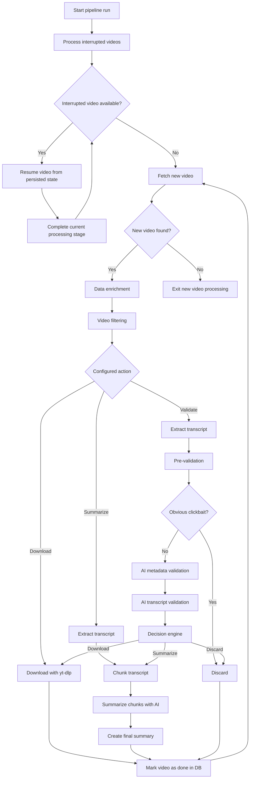
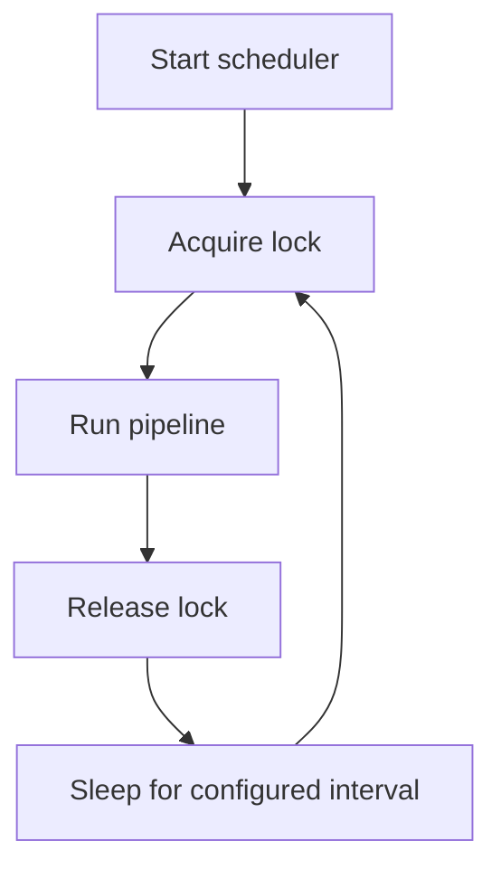

# `vidsift`

**AI-powered YouTube feed filtering and transcript-based video processing.**


`vidsift` is a command-line tool for reducing the amount of time you spend on YouTube. It monitors configured YouTube channels, decides what is worth consuming, and either downloads, summarizes, or discards videos according to rules you define.

The entire pipeline runs locally and linearly. AI processing uses local models through **Ollama** or **LM Studio**.

## Table of Contents

- [Why vidsift?](#why-vidsift)
- [How it works](#how-it-works)
- [Processing modes](#processing-modes)
  - [Download](#download)
  - [Summarize](#summarize)
  - [Validate](#validate)
- [Validation](#validation)
  - [Pre-validation](#1-pre-validation)
  - [AI metadata validation — 20%](#2-ai-metadata-validation--20)
  - [AI transcript validation — 80%](#3-ai-transcript-validation--80)
  - [Final decision](#4-final-decision)
- [Custom channel instructions](#custom-channel-instructions)
- [Video database and interrupted processing](#video-database-and-interrupted-processing)
- [Fetching and filtering](#fetching-and-filtering)
- [Scheduling](#scheduling)
- [Locking](#locking)
- [Installation](#installation)
  - [Requirements](#requirements)
  - [Install from Git](#install-from-git)
- [Initial setup](#initial-setup)
- [Configuration](#configuration)
  - [AI provider](#ai-provider)
  - [`yt-dlp`](#yt-dlp)
- [Channel configuration](#channel-configuration)
- [Downloads](#downloads)
- [Manual video processing](#manual-video-processing)
- [Managing processed videos](#managing-processed-videos)
- [Running the pipeline](#running-the-pipeline)
- [Background service](#background-service)
- [Logs](#logs)
- [Global CLI options](#global-cli-options)
- [Using vidsift without AI](#using-vidsift-without-ai)
- [Autocompletion](#autocompletion)
- [Troubleshooting](#troubleshooting)
- [Important design constraints](#important-design-constraints)
- [Complete command overview](#complete-command-overview)
- [Example workflow](#example-workflow)
- [Limitations](#limitations)
- [Philosophy](#philosophy)

## Why vidsift?

YouTube is optimized for keeping you watching. `vidsift` is designed around the opposite goal:

> **Filter YouTube before you consume it.**

Instead of opening YouTube and browsing a feed, videos can be collected and processed in the background while you can do whatever you want.

Depending on your configuration, `vidsift` can:

- download videos that are relevant enough to watch
- summarize videos that are somewhat relevant
- discard videos that are irrelevant or obviously clickbait
- process videos from specific channels according to custom instructions
- keep the results accessible outside YouTube

This can reduce common YouTube distractions such as recommendations and rabbit holes. Downloaded videos can also be watched without relying on YouTube's streaming experience.

## How it works

`vidsift` is a **single-process, linear, pipeline-oriented application**. It does not use multiprocessing to process videos concurrently.

> Vidsift is primarily designed as a local application.
> It does not provide a security boundary around the local machine, local configuration, downloaded content, or locally executed AI models.

At a high level:

### Single Pipeline Run


### Video Processing Flow



>*Processing state is persisted after each major processing stage, allowing interrupted videos to resume from their last completed stage.*

---

# Processing modes

Each configured channel has an action.

## `download`

Every new video from the channel is downloaded directly with `yt-dlp`.

Validation is skipped.

This is useful for channels where you already know that you want the videos.

## `summarize`

Every new video is summarized without going through the validation pipeline.

The process is:

1. Fetch the transcript.
2. Split the transcript into chunks.
3. Summarize each chunk with AI.
4. Combine the chunk summaries into a final summary.
5. Write the summary to a Markdown file.

The output filename is based on the video title and video ID. Metadata can optionally be included at the beginning of the file.

## `validate`

Validation decides what happens to each video.

The final decision can be:

- **download**
- **summarize**
- **discard**

Validation uses both cheap local heuristics and local AI.

---

# Validation

Validation is deliberately split into stages so obviously bad videos can be discarded before spending additional AI compute.

## 1. Pre-validation

Pre-validation does **not use AI**.

It looks for signals such as:

- excessive uppercase characters
- excessive punctuation
- excessive emoji usage
- clickbait phrases in the title
- clickbait phrases in the transcript

There are configurable thresholds for strong signals and weaker signals.

If the video is obviously clickbait, validation stops and the video is discarded. Pre-validation is a **gate**, not part of the 20/80 AI scoring system.

This makes it possible to reject obvious cases without spending local model inference time on them.

## 2. AI metadata validation — 20%

Videos that pass pre-validation are sent to the configured local AI model for metadata validation.

The model receives information such as:

- title
- author
- URL
- video ID

- length
- custom instructions for the channel

It evaluates both relevance to the configured channel instructions and content quality/clickbait-related signals.

## 3. AI transcript validation — 80%

The transcript is not sent to the model in its entirety.

`vidsift` extracts representative portions:

- first two transcript chunks
- one middle chunk
- last two transcript chunks

For very short transcripts where those regions overlap, duplicate chunks are removed.

This gives the model information from different parts of the video while keeping the amount of text sent to the model substantially smaller than the complete transcript.

The chunk size can be configured in the config.

## 4. Final decision

The metadata and transcript results are combined using an **80% transcript / 20% metadata weighting**.

This weighting is applied both to the topic-match score and the quality score.

The current decision logic is:

| Result                                | Decision  |
| ------------------------------------- | --------- |
| High topic match + high quality       | Download  |
| Medium+ topic match + high quality    | Download  |
| Medium+ topic match + medium+ quality | Summarize |
| High topic match + medium+ quality    | Summarize |
| High quality + low topic match        | Summarize |
| Low topic match                       | Discard   |
| Everything else                       | Discard   |

The current implementation uses thresholds of **2.5 for high** and **1.8 for medium**.

---

# Custom channel instructions

> Validation can be customized per channel.

For example, a channel instruction file could tell the AI:

```text
Only download videos primarily about Linux.

Videos about Linux administration, system internals,
Linux networking, shell scripting and Linux security
should receive high topic-match scores.

Videos unrelated to Linux should receive low topic-match scores 
as well as low content quality scores.
and should normally be discarded.
```

The same instruction file can be reused for multiple channels.

Channel instructions are stored in:

```text
<user config directory>/vidsift/custom_channel_instructions/
```

A channel then references the instruction filename:

```toml
[[channels]]
id = "UCo71RUe6DX4w-Vd47rFLXPg"
action = "validate"
instruction = "linux_channels.md"
```

Instructions are only required for `validate` channels because `download` and `summarize` do not use validation.

---

# Video database and interrupted processing

`vidsift` maintains a SQLite database containing processed and currently-processing videos.

The database is used to prevent the same video from being processed repeatedly and to persist processing state.

A video can have states including:

```text
data_enriching
validating
downloading
summarizing
done
failed
```

### Why `data_enriching` exists

Some filtering operations require additional information from `yt-dlp`.

Before those filters can run, `vidsift` may have to fetch additional video data, which means that data enrichment can itself take time because of configured `yt-dlp` delays.

A newly discovered RSS video is therefore initially recorded as `data_enriching` before filtering takes place.

The goal of this is to not process livestreams (very long) and members-only content (fails on yt-dlp).

### Resume behavior

Processing state is updated as the pipeline progresses.

For example, a video that already passed validation and was interrupted during summarization does not need to go through validation again. Its persisted state allows `vidsift` to continue from the appropriate processing stage.

Failed processing attempts increment the video's retry count. Once the configured retry limit is reached, the video is marked as failed and abandoned.

With the default:

```toml
[video_processing]
max_retry_attempts = 1
```

the first failure increments the retry count, allowing one subsequent retry before the video is abandoned.

---

# Fetching and filtering

Videos are collected from configured YouTube channels.

RSS is used for channel discovery, with `yt-dlp` available as a fallback for video collection. The configured amount of fallback videos affects the tradeoff between finding missing videos and making more requests to YouTube.

During validation of the rss entries, youtube shorts get filtered out. `vidsift` cannot be processed with `vidsift process`

Before processing a newly discovered video, `vidsift` can filter out videos such as:

- livestreams
- members-only content

Additional video data needs to be fetched before these filters can run.

That additional video data fetching as well as the filters don't run on the yt-dlp fallback.

The default configuration also limits how old newly discovered videos can be (RSS feed fetching):

```toml
[video_processing]
days_uploaded_before = 7
```

This restriction applies to new videos, not interrupted/failed videos.

---

# Scheduling

`vidsift run` performs one complete pipeline run.

`vidsift schedule` repeatedly executes the pipeline:



The default scheduler interval is 30 minutes.

The interval can be overridden:

```bash
vidsift schedule --sleep-interval 900
```

The important distinction is that the scheduler is **not** a concurrent worker system.

There is still only one processing pipeline executing at a time.

---

# Locking

`vidsift` uses a process lock to prevent multiple pipeline runs from processing videos simultaneously.

If another `vidsift` instance already owns the lock, a second instance waits until the lock becomes available instead of starting concurrent processing.

The scheduled runner releases the lock after a pipeline run finishes and before entering its cooldown period. This means another command such as:

```bash
vidsift run
```

or:

```bash
vidsift process ...
```

can process a video while the scheduler is sleeping. The scheduler reacquires the lock before its next pipeline run.

`vidsift` intentionally does **not** process multiple videos concurrently.

This keeps the execution model predictable and avoids aggressively increasing `yt-dlp` traffic which can cause blocking when automated.

---

# Installation

## Requirements

Current `vidsift` requires:

- Python **3.14 or newer**
- Linux or Windows

- [yt-dlp](https://www.github.com/yt-dlp/yt-dlp) with a js runtime
- a supported local AI runtime:

  - [Ollama](https://ollama.com/)
  - [LM Studio](https://www.lmstudio.ai/)
- a browser profile that `yt-dlp` can read cookies from (for more info, check [this](https://github.com/yt-dlp/yt-dlp/wiki/FAQ#how-do-i-pass-cookies-to-yt-dlp) out)
- enough storage for downloaded videos and local AI models
- `pip` or `pipx`
- `git` when installing directly from the repository

The package declares Python `>=3.14` and the runtime dependencies include `yt-dlp`, `ollama`, `lmstudio`, `youtube-transcript-api`, `portalocker`, `rich`, `argcomplete`, and related libraries.

`vidsift` is designed for local AI inference, so hardware requirements depend heavily on the models you configure.

## Install from Git

```bash
git clone https://github.com/daemonnd/vidsift.git
cd vidsift
pipx install .
pipx ensurepath
```

For a normal `pip` installation:

```bash
pip install .
```

After installing with `pipx`, verify that the executable is available:

```bash
which vidsift
```

On Linux it will normally be somewhere under:

```text
$HOME/.local/bin/vidsift
```

The project exposes the `vidsift` command through its Python package entry point.

---

# Initial setup

Initialize the local configuration and data directories:

```bash
vidsift init
```

Initialization creates the required directories and installs the default configuration and bundled system prompts.

Show the configuration path:

```bash
vidsift config --filepath
```

Edit it with your preferred editor:

```bash
$EDITOR "$(vidsift config --filepath)"
```

`vidsift config` can also print either the loaded configuration or the actual config file contents:

```bash
vidsift config
vidsift config --file
```

A custom configuration file can also be supplied for a single invocation:

```bash
vidsift --config /path/to/config.toml run
```

---

# Configuration

The complete default configuration is created by:

```bash
vidsift init
```

The main configuration sections are:

```toml
[logging]
[video_fetching]
[ai]
[ai.tasks.metadata_validation]
[ai.tasks.transcript_validation]
[ai.tasks.chunk_summary]
[ai.tasks.overall_summary]
[video_processing]
[video_processing.yt_dlp.base]
[video_processing.yt_dlp.download]
[validation]
[validation.pre_validation.max_allowed]
[validation.pre_validation.weak]
[validation.pre_validation.weights]
[summarization]
[downloads]
[[channels]]
```

The default configuration contains separate AI settings for metadata validation, transcript validation, chunk summarization and final summarization. Each task can have its own model, context length, maximum output tokens and thinking configuration.

## AI provider

The supported providers are:

```toml
[ai]
provider = "ollama"
base_url = "http://localhost:11434"
```

or:

```toml
[ai]
provider = "lmstudio"
base_url = "http://localhost:1234"
```

The configured model must be available in the selected runtime.

A single model can be supplied for every AI task with:

```bash
vidsift --global-ai-model MODEL run
```

This changes the model reference for all configured AI tasks while leaving their other settings unchanged.

## `yt-dlp`

`vidsift` passes the configured `video_processing.yt_dlp.base` settings to `yt-dlp`.

Example:

```toml
[video_processing.yt_dlp.base]
max_retries = 10
sleep_requests = 10
cookies_from_browser = "firefox"
quiet = true
```

A browser profile is used for cookies so `yt-dlp` can access the videos required by the pipeline.

You should also configure JavaScript runtimes supported by `yt-dlp`, such as Deno or Node.

---

# Channel configuration

Channels are configured with `[[channels]]` entries.

```toml
[[channels]]
id = "UC9x0AN7BWHpCDHSm9NiJFJQ"
action = "download"

[[channels]]
id = "UCo71RUe6DX4w-Vd47rFLXPg"
action = "validate"
instruction = "linux_channels.md"

[[channels]]
id = "UC4JX40jDee_tINbkjycV4Sg"
action = "summarize"
```

Available actions:

| Action      | Behavior                                                      |
| ----------- | ------------------------------------------------------------- |
| `download`  | Download every new video without validation                   |
| `summarize` | Summarize every new video without validation                  |
| `validate`  | Validate videos and then download, summarize, or discard them |

For `validate`, `instruction` points to a plain-text instruction file under the `custom_channel_instructions` directory.

---

# Downloads

Normal downloads are written to the configured directory:

```toml
[downloads]
output_dir = "/path/to/videos/"
```

`yt-dlp` handles the actual video download.

There is also a **fake download** mode for systems with lower disk space. Then, the videos that would have been downloaded get their urls written to the file specified in the config:

```toml
[download]
output_file = "/path/to/output/file"
```

For example:

```bash
vidsift run --fake-download
```

This writes the URLs of videos that would have been downloaded to the configured fake-download output file instead of downloading them.

A custom output path can be supplied directly. That overrides the config value.

```bash
vidsift run --fake-download /path/to/to_watch.md
```

The same functionality is available for scheduled processing.

---

# Manual video processing

A specific video can be processed without running the entire channel pipeline.

Basic usage:

```bash
vidsift process "https://www.youtube.com/watch?v=VIDEO_ID" --download
```

or:

```bash
vidsift process "https://www.youtube.com/watch?v=VIDEO_ID" --summarize
```

To only fetch and print the transcript:

```bash
vidsift process "https://www.youtube.com/watch?v=VIDEO_ID" --fetch-transcript
```

Manual downloads can also use fake-download mode by appending `--fake-download`.

The `process` command is mutually exclusive between download, summarize and transcript-fetching modes.

---

# Managing processed videos

Use:

```bash
vidsift videos
```

to print the video database path to stdout.

List videos (all):

```bash
vidsift videos list
```

Filter by status:

```bash
vidsift videos list --status done
```

```bash
vidsift videos list --status failed
```

Filter by video:

```bash
vidsift videos list --video-id VIDEO_ID
```

Filter by channel:

```bash
vidsift videos list --channel-id CHANNEL_ID
```

Remove a video from the database:

```bash
vidsift videos rm VIDEO_ID
```

Removing the database entry allows that video to be processed again.

The database itself can be located with:

```bash
vidsift videos --show-db-path
```

The default data directory contains the processing database and the process lock.

---

# Running the pipeline

Run one pipeline:

```bash
vidsift run
```

By default, interrupted videos are processed before new videos.

To process only new videos:

```bash
vidsift run --skip-interrupted
```

To process only interrupted videos:

```bash
vidsift run --skip-new
```

These options are mutually exclusive.

However, it is also possible to configure these options under

```toml
[video_processing]
skip_interrupted_vids = false
skip_new_vids = false
```

If both get skipped, no video gets processed.

---

# Background service

`vidsift service` manages an operating-system background service that starts the scheduler.

```bash
vidsift service --status
```

Start it immediately:

```bash
vidsift service --start
```

Enable it:

```bash
vidsift service --enable
```

Stop it:

```bash
vidsift service --stop
```

Disable it:

```bash
vidsift service --disable
```

Restart it:

```bash
vidsift service --restart
```

The project integrates with platform-specific service mechanisms rather than implementing its own daemon. The supported service backends include systemd on Linux and schtasks on Windows.

> **Current support:** Linux and Windows are supported. macOS is not currently supported as a target platform.

---

# Logs

`vidsift` writes structured logs in JSON Lines format.

The default log file is:

```text
<user log directory>/vidsift/vidsift.jsonl
```

File logs are rotated according to the configured rotation policy and can be retained for a configurable number of days.

Inspect recent logs:

```bash
vidsift logs
```

Show more entries:

```bash
vidsift logs --last 100
```

Follow the current log file:

```bash
vidsift logs --follow
```

Filter by level:

```bash
vidsift logs --level ERROR
```

Search messages:

```bash
vidsift logs --contains "download"
```

Show logs from all log files:

```bash
vidsift logs --all-files
```

Disable terminal colors:

```bash
vidsift logs --no-colors
```

Custom output formatting is available through:

```text
$timestamp
$level
$run_id
$event
$logger
$message
```

For example:

```bash
vidsift logs --format '$level: $event $message'
```

Vidsift's .jsonl logs contain even more fields, but they are not availible in `vidsift logs`

---

# Global CLI options

All commands support the following global options:

```text
--config PATH
--loglevel {DEBUG,INFO,WARNING,ERROR,CRITICAL}
--global-ai-model MODEL
--skip-ai-checks
--debug {dependencies,all,yt-dlp}
```

Examples:

```bash
vidsift --loglevel DEBUG run
```

```bash
vidsift --global-ai-model qwen3.5:9b run
```

```bash
vidsift --debug yt-dlp run
```

`--debug` affects console logging. `--debug dependencies` enables debug-level dependency logs, `--debug yt-dlp` enables non-quiet `yt-dlp` output, and `--debug all` enables both plus full debug console logging.

---

# Using vidsift without AI

AI is required for:

- validation
- summarization

Direct downloading does not require an AI model.

If AI is not configured yet, AI startup checks can be skipped:

```bash
vidsift --skip-ai-checks run
```

This is primarily useful for download-only operation or testing. Skipping the checks does **not** make validation or summarization work without a compatible AI provider.

---

# Autocompletion

`vidsift` uses `argcomplete`.

For Bash:

```bash
echo 'eval "$(register-python-argcomplete vidsift)"' >> ~/.bashrc
source ~/.bashrc
```

For Zsh:

```bash
echo 'eval "$(register-python-argcomplete vidsift)"' >> ~/.zshrc
source ~/.zshrc
```

After that, shell completion is available for commands and arguments.

---

# Troubleshooting

## `vidsift init` fails while copying prompts

Current versions initialize bundled system prompts automatically.

If initialization fails with an error such as:

```text
NameError: name 'prompts_dir' is not defined
```

and the repository checkout is available, the bundled prompts can be copied manually:

```bash
cp -r src/vidsift/defaults/system_prompts ~/.config/vidsift
```

Then configure the installed configuration normally.

## `yt-dlp` fails

Check that:

1. the configured browser exists
2. the browser profile is accessible
3. the browser is logged into the required Google/YouTube account
4. `yt-dlp` works independently with the configured cookie settings
5. The configured JS runtime works with yt-dlp

For additional `yt-dlp` output:

```bash
vidsift --debug yt-dlp run
```

If you already did all that and still get a `403: forbidden` error, it can help to connect another google account to youtube because it got used too much.

## AI checks fail

Check the configured provider and model independently.

For Ollama, verify that the configured model exists and that the server is reachable.

For LM Studio, verify that the configured server is running and that the configured endpoint is correct.

It is still possible, especially when not using localhost that AI checks fail even though the AI is availble. In that case, it is recommended to always skip ai checks in the config like this:

```toml
[ai]
skip_ai_checks = true
```

For debugging:

```bash
vidsift --debug all run
```

As a last-resort testing option:

```bash
vidsift --skip-ai-checks run
```

Do not use `--skip-ai-checks` as a substitute for fixing an incompatible model or provider configuration in a background installation.

---

# Important design constraints

`vidsift` deliberately keeps its execution model simple.

### Linear execution

Videos are processed one at a time.

There is no multiprocessing-based video processing.

### One pipeline at a time

The process lock prevents multiple pipeline runs from processing videos concurrently.

### Local AI

The intended AI providers are Ollama and LM Studio.

No cloud AI provider is required or availible by the application.

### Database-backed state

Processing state is persisted so interruptions do not automatically force an entire video through the pipeline again.

### Vidsift background service

Processing Youtube is slow. That is one of the main reasons that vidsift is intended to run with `vidsift schedule` in the background.
Additionally, you can do better things then checking YouTube while vidsift already does that for you!

### You control the filtering policy

The AI does not define what is relevant by itself. Channel-specific instructions allow you to define what relevance means for each channel.

---

# Complete command overview

```text
vidsift
├── init
├── run
├── config
├── process
├── videos
│   ├── list
│   ├── set-status
│   └── rm
├── schedule
├── service
└── logs
```

Use:

```bash
vidsift COMMAND --help
```

for the command-specific options.

---

# Example workflow

A minimal setup might look like this:

```bash
# Install
git clone https://github.com/daemonnd/vidsift.git
cd vidsift
pipx install .

# Initialize
vidsift init

# Edit configuration
$EDITOR "$(vidsift config --filepath)"

# Test one pipeline run
vidsift run

# Run continuously
vidsift schedule

# Inspect what happened
vidsift videos list
vidsift logs --last 50
```

A more selective setup could configure:

```text
Channel A → download
Channel B → summarize
Channel C → validate → download / summarize / discard
```

This lets `vidsift` act as a personal preprocessing layer between YouTube and the content you actually consume.

---

# Limitations

`vidsift` is intentionally not a general-purpose YouTube automation platform.

Current limitations include:

- processing is linear
- videos are not processed concurrently
- local AI inference requires suitable hardware
- validation and summarization require a supported local AI provider
- real video downloading requires significant disk space
- `yt-dlp` access depends on a working browser-cookie configuration
- the CLI is the primary interface
- the current supported desktop operating systems are Linux and Windows

The project does not attempt to hide the fact that processing YouTube content can be slow. Transcript fetching, metadata enrichment, AI inference and downloads are all real processing steps, and `vidsift` intentionally inserts delays between video-processing operations to control request frequency.

---

# Philosophy

`vidsift` is built around a simple idea:

> **Do not optimize your YouTube consumption. Reduce your exposure to YouTube in the first place.**

The goal is not to create a better YouTube feed.

The goal is to create a filter between YouTube and the content you actually want to spend time on.
